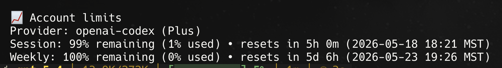

# chatgpt-limits

A shareable Hermes plugin that exposes ChatGPT / OpenAI Codex account limits using the same internal OAuth-backed usage code Hermes already uses for `/usage`.

It is designed to be installed on another Hermes instance so the other user can authenticate with their own OAuth session and query their own limits.



## English

### What it reuses from Hermes

Hermes already has account-limit support in `agent/account_usage.py`.

For `openai-codex`, that code:
- refreshes runtime credentials with `resolve_codex_runtime_credentials(refresh_if_expiring=True)`
- reads the stored `account_id` from Hermes auth state
- sends `Authorization: Bearer [REDACTED]`
- sends `ChatGPT-Account-Id: <account_id>` when available
- resolves the usage URL from the Codex base URL
- defaults to `https://chatgpt.com/backend-api/codex`
- queries the usage endpoint at `/wham/usage`

This plugin intentionally reuses that code instead of screen-scraping or browser automation.

### Features

- Tool: `chatgpt_limits`
- Slash command: `/chatgpt-limits`
- CLI subcommand: `hermes chatgpt-limits`
- Bundled skill: `chatgpt-limits:chatgpt-limits`
- Works from CLI and gateway chats because the command runs on the Hermes host and uses local OAuth state
- Can still fetch ChatGPT/Codex limits even when the active conversation provider is different
- JSON mode for automation or debugging

### Requirements

- Hermes Agent installed
- A Hermes version with plugin support
- OAuth authentication on that machine:

```bash
hermes login --provider openai-codex
```

### Install

#### Option 1: install directly from GitHub

```bash
hermes plugins install https://github.com/itrejomx/chatgpt-limits.git --enable
```

After installing, start a new Hermes session. If using the gateway, restart it or start a fresh chat session so the plugin command is loaded.

#### Option 2: clone locally for development

```bash
git clone https://github.com/itrejomx/chatgpt-limits.git
cd chatgpt-limits
mkdir -p ~/.hermes/plugins
ln -s "$(pwd)" ~/.hermes/plugins/chatgpt-limits
hermes plugins enable chatgpt-limits
```

### Authentication

Each user must authenticate with their own account. Tokens are not shared by this plugin.

```bash
hermes login --provider openai-codex
```

### Usage

#### In any Hermes chat session

```text
/chatgpt-limits
```

#### CLI command

```bash
hermes chatgpt-limits
```

#### Raw JSON output

```text
/chatgpt-limits json
```

```bash
hermes chatgpt-limits --json
```

#### Provider override

This plugin is mainly intended for ChatGPT / Codex, but it reuses Hermes account-usage helpers so you can optionally try another supported provider.

```text
/chatgpt-limits anthropic
```

```bash
hermes chatgpt-limits anthropic
```

### Example output

```text
📈 Account limits
Provider: openai-codex (Plus)
Session: 81% remaining (19% used) • resets in 4h 42m (2026-05-18 18:21 MST)
Weekly: 97% remaining (3% used) • resets in 5d 5h (2026-05-23 19:26 MST)
```

### Example JSON output

```json
{
  "available": true,
  "provider": "openai-codex",
  "plan": "Plus",
  "source": "usage_api",
  "title": "Account limits",
  "windows": [
    {
      "label": "Session",
      "used_pct": 19.0,
      "remaining_pct": 81.0,
      "reset_at": "2026-05-19T00:21:00+00:00"
    },
    {
      "label": "Weekly",
      "used_pct": 3.0,
      "remaining_pct": 97.0,
      "reset_at": "2026-05-24T01:26:00+00:00"
    }
  ]
}
```

### Example natural-language prompts

- check my chatgpt limits
- show my codex quota
- how much usage do I have left for chatgpt?
- show my session and weekly chatgpt limits

### Gateway / Telegram note

Yes, this can work over Telegram or other Hermes channels.

Reason: the slash command runs on the machine hosting Hermes, not on the messaging client. So it can read that Hermes instance's local OAuth state and query the same backend usage endpoint.

### Troubleshooting

If the command does not show limits:

1. Check auth:
   ```bash
   hermes login --provider openai-codex
   ```
2. Confirm the plugin is enabled:
   ```bash
   hermes plugins list
   ```
3. Start a new session or restart the gateway.
4. Try JSON mode to inspect the raw payload:
   ```bash
   hermes chatgpt-limits --json
   ```

### Files

- `plugin.yaml`
- `__init__.py`
- `schemas.py`
- `tools.py`
- `skills/chatgpt-limits/SKILL.md`
- `assets/chatgpt-limits-example.png`

## Español

### Qué reutiliza de Hermes

Hermes ya tiene soporte de límites de cuenta en `agent/account_usage.py`.

Para `openai-codex`, ese código:
- actualiza credenciales runtime con `resolve_codex_runtime_credentials(refresh_if_expiring=True)`
- lee el `account_id` guardado en el estado de autenticación de Hermes
- envía `Authorization: Bearer [REDACTED]`
- envía `ChatGPT-Account-Id: <account_id>` cuando está disponible
- resuelve la URL de usage a partir de la base URL de Codex
- usa por defecto `https://chatgpt.com/backend-api/codex`
- consulta el endpoint `/wham/usage`

Este plugin reutiliza intencionalmente ese código en lugar de hacer scraping de pantalla o automatización del navegador.

### Características

- Herramienta: `chatgpt_limits`
- Slash command: `/chatgpt-limits`
- Subcomando CLI: `hermes chatgpt-limits`
- Skill incluida: `chatgpt-limits:chatgpt-limits`
- Funciona desde CLI y desde chats por gateway porque el comando se ejecuta en el host de Hermes y usa el estado OAuth local
- Puede consultar límites de ChatGPT/Codex aunque el proveedor activo de la conversación sea otro
- Modo JSON para automatización o depuración

### Requisitos

- Hermes Agent instalado
- Una versión de Hermes con soporte para plugins
- Autenticación OAuth en esa máquina:

```bash
hermes login --provider openai-codex
```

### Instalación

#### Opción 1: instalar directamente desde GitHub

```bash
hermes plugins install https://github.com/itrejomx/chatgpt-limits.git --enable
```

Después de instalar, inicia una nueva sesión de Hermes. Si usas gateway, reinícialo o abre un chat nuevo para que cargue el comando del plugin.

#### Opción 2: clonar localmente para desarrollo

```bash
git clone https://github.com/itrejomx/chatgpt-limits.git
cd chatgpt-limits
mkdir -p ~/.hermes/plugins
ln -s "$(pwd)" ~/.hermes/plugins/chatgpt-limits
hermes plugins enable chatgpt-limits
```

### Autenticación

Cada usuario debe autenticarse con su propia cuenta. Este plugin no comparte tokens.

```bash
hermes login --provider openai-codex
```

### Uso

#### En cualquier sesión de chat de Hermes

```text
/chatgpt-limits
```

#### Comando CLI

```bash
hermes chatgpt-limits
```

#### Salida JSON cruda

```text
/chatgpt-limits json
```

```bash
hermes chatgpt-limits --json
```

#### Forzar otro provider

Este plugin está pensado principalmente para ChatGPT / Codex, pero reutiliza los helpers de account usage de Hermes, así que opcionalmente puedes probar otro provider soportado.

```text
/chatgpt-limits anthropic
```

```bash
hermes chatgpt-limits anthropic
```

### Ejemplo de salida

```text
📈 Account limits
Provider: openai-codex (Plus)
Session: 81% remaining (19% used) • resets in 4h 42m (2026-05-18 18:21 MST)
Weekly: 97% remaining (3% used) • resets in 5d 5h (2026-05-23 19:26 MST)
```

### Ejemplo de salida JSON

```json
{
  "available": true,
  "provider": "openai-codex",
  "plan": "Plus",
  "source": "usage_api",
  "title": "Account limits",
  "windows": [
    {
      "label": "Session",
      "used_pct": 19.0,
      "remaining_pct": 81.0,
      "reset_at": "2026-05-19T00:21:00+00:00"
    },
    {
      "label": "Weekly",
      "used_pct": 3.0,
      "remaining_pct": 97.0,
      "reset_at": "2026-05-24T01:26:00+00:00"
    }
  ]
}
```

### Prompts en lenguaje natural

- check my chatgpt limits
- show my codex quota
- how much usage do I have left for chatgpt?
- show my session and weekly chatgpt limits

### Nota sobre Gateway / Telegram

Sí, esto puede funcionar por Telegram u otros canales de Hermes.

La razón es que el slash command corre en la máquina que hospeda Hermes, no en el cliente de mensajería. Por eso puede leer el estado OAuth local de esa instancia de Hermes y consultar el mismo endpoint backend de usage.

### Solución de problemas

Si el comando no muestra límites:

1. Revisa autenticación:
   ```bash
   hermes login --provider openai-codex
   ```
2. Confirma que el plugin está habilitado:
   ```bash
   hermes plugins list
   ```
3. Inicia una nueva sesión o reinicia el gateway.
4. Prueba modo JSON para inspeccionar la respuesta cruda:
   ```bash
   hermes chatgpt-limits --json
   ```

### Archivos

- `plugin.yaml`
- `__init__.py`
- `schemas.py`
- `tools.py`
- `skills/chatgpt-limits/SKILL.md`
- `assets/chatgpt-limits-example.png`

## License

MIT. If you want, I can later split this into dual licensing, for example MIT for code and CC BY for documentation assets.
